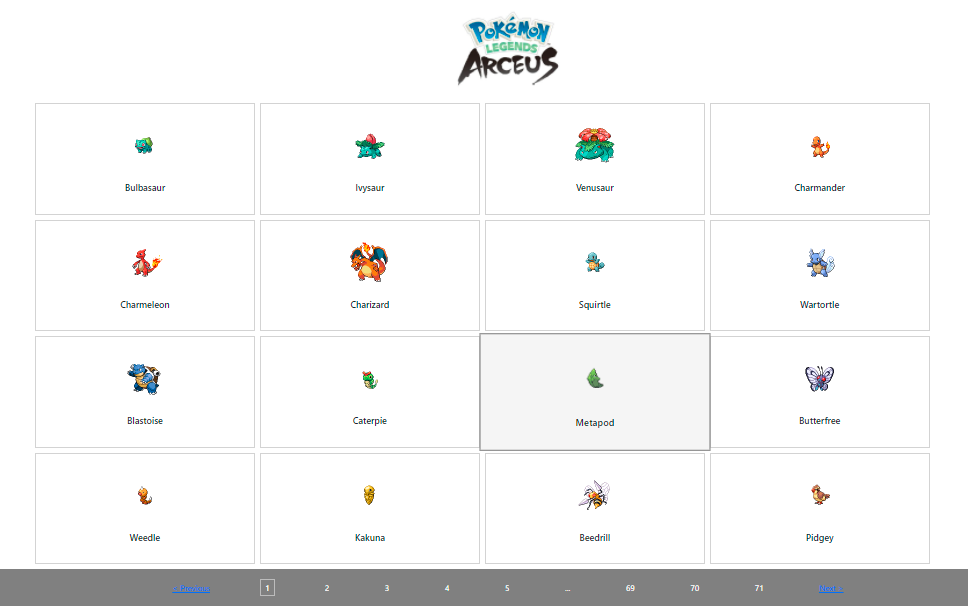
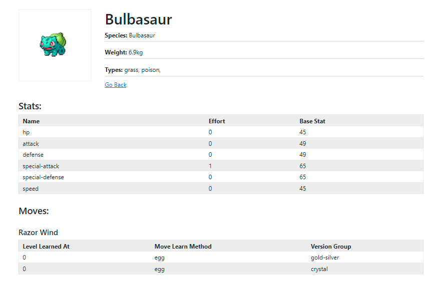

## Pokemon Challenge Pages

## Technologies Used

This application is built using the latest version of React and typeScript and some additions libraries like:
- react-router-dom: ^6.2.1
- axios: ^0.25.0
- react-paginate: ^8.1.0
- sass: ^1.49.7"

## Project Structure
### components - in this folder are three base components
- PokemonsList (A component to show a list of Pokemons with pagination)
- PokemonItem (Is a component that shows basic details for a Pokemon, and this component is a child component of PokemonsList)
- PokemonDetails (Shows all details related to e specific Pokemon)

### config
In the config folder is created an instance for axios, where is specified baseURL and headers.

### models
In the models folder we have the Pokemon interface and other interfaces related to this.

### services
Includes the PokemonService that have methods for get all pokemons and get pokemons by id.

## Improvements
- In the details page was needed to create a reusable component for Table, but for time reasons was not possible.
- Also for Moves in details page are a lot of data in some cases, and using pagination will be good.
- In the Pokemons list we need to show a message when no data, and to hide paginations.
- To add a spinner on Pokemons data load.
- To add a NotFound page if the user type a wrong url.
- Also Is good to write some unit tests for each component.
- To show any message if any error happens during data fetch.
- Also to put the pagination in a separate component